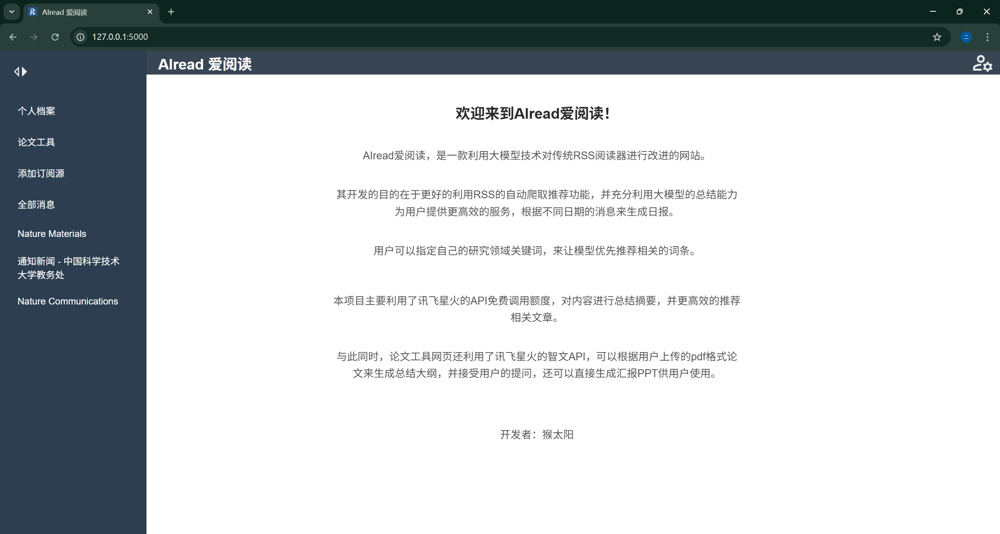
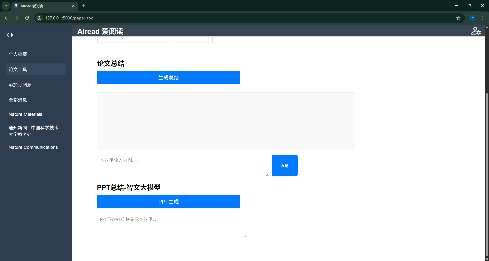
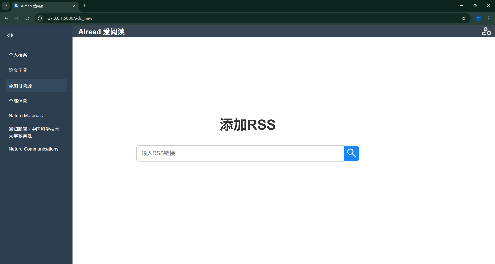
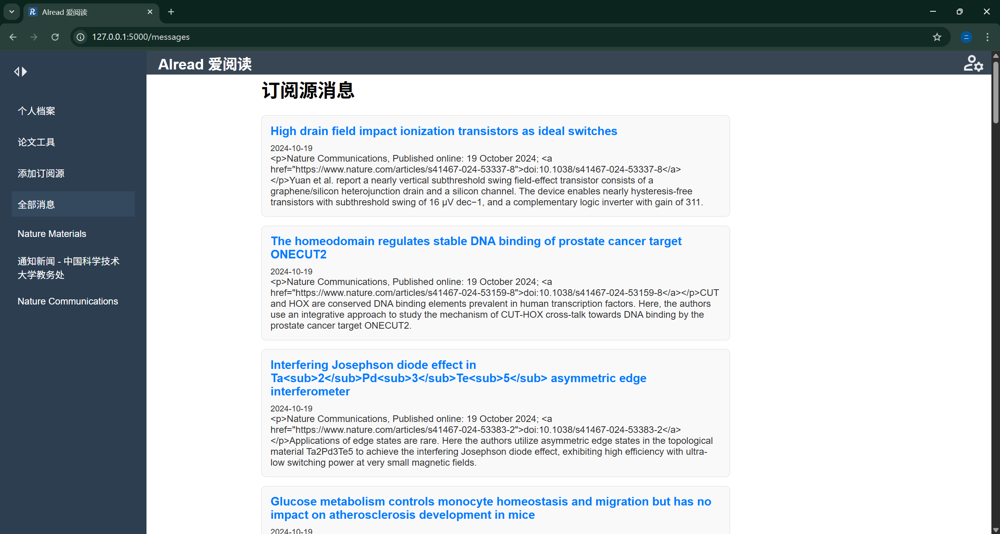
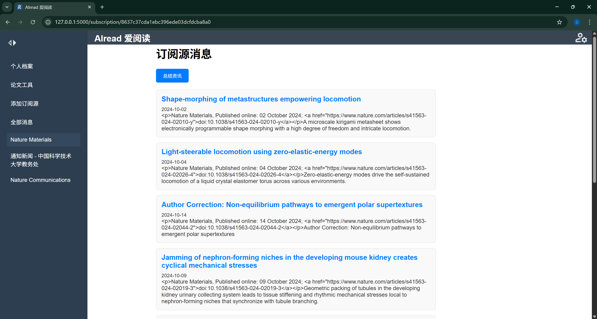
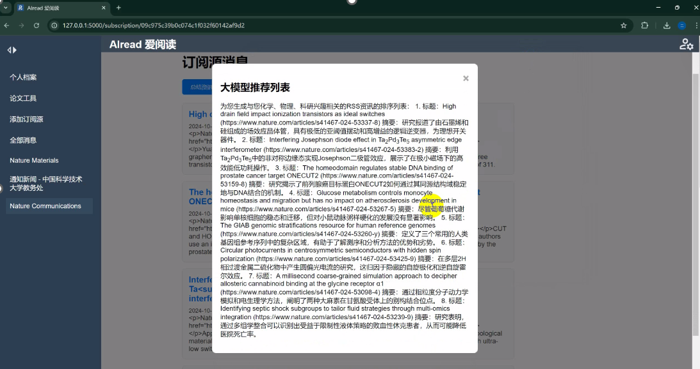

# AIread

> 一个RSS+大模型的网站demo设计
>
> 通过科大讯飞星火大模型API进行配置，技术栈为Flask/HTML三件套。

### 项目想法

面对大量的信息投喂，如何找到贴合自己研究关注领域的内容是一个令人头疼的问题，所以需要针对你的研究领域来进行一个搜索。利用大模型的理解能力，找到相关的内容优先推荐，通过手动订阅关键词，检索相关的消息。

相比于传统的RSS，亮点工作有以下：

- 对搜集的信息进行总结整理，并且可以进行提问；
- 直接对原文内容进行读取，有更多的细节可以去提取；
- 通过论文信息直接生成ppt展示。


## 用户配置

需要配置讯飞星火大模型的API，并通过环境变量保存，通过python调用环境变量进行使用。

```python
        APPId = os.getenv('XUNFEI_APPID')
        APISecret = os.getenv('XUNFEI_APISECRET')
```

配置API参见：[控制台-讯飞开放平台](https://console.xfyun.cn/services/sparkapiCenter) 


## 功能设计

### RSS订阅构建

用户自行导入的RSS链接进行订阅

可以提供一些常用的网站订阅推荐，或者直接进行搜索的功能

### RSS总结

调用大模型对订阅内容进行总结，最好能爬取内部的文章的具体内容，然后整体进行识别读取，或者只对摘要进行一个进一步处理

然后再对分条目的总结进行一个日报的生成，最好能在服务器端进行处理。

### RSS重点推荐

通过用户自行定义的研究领域和兴趣点，来推荐相关的条目和细节。

### 论文阅读写作

对完整论文进行读取和总结，提供一个调研的展示功能，展示文字内容或者ppt模板。

并提供写作辅导，根据用户设定的主题建立文章大纲，并在用户进一步进行段落的细化和细节完善之后对段落进行下一步的续写。


## 前端页面设计

主页面：



论文工具：



添加订阅源：



订阅源消息：



具体的订阅源通道：



资讯总结：




